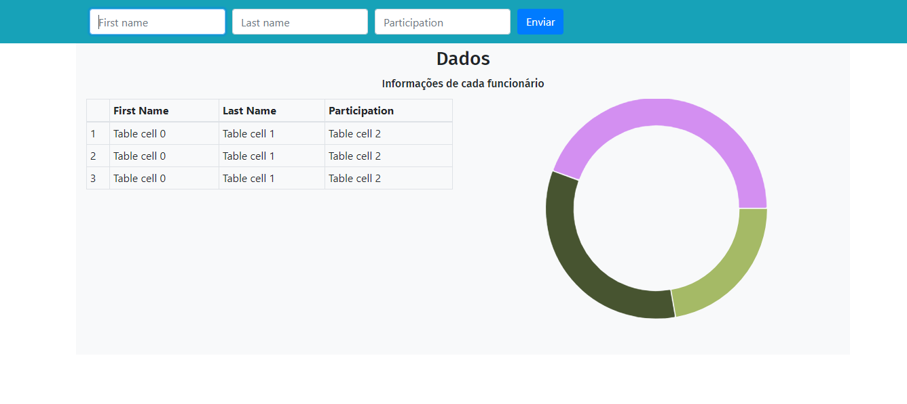

<h1 align="center">Teste Cotabox</h1>

<p align="center">Teste que visa aplicar os conhecimentos adquiridos</p>

<p align="center">
 <a href="#funções">Funções</a> • 
 <a href="#Pré-requisitos">Rodando</a> • 
 <a href="#tecnologias">Tecnologias</a> • 
 <a href="#autor">Autor</a>
</p>

<h4 align="center"> 
	🚧  Teste em construção...  🚧
</h4>

<p align="center">

</p>

### Funções

- [ ] Cadastro de pessoas e suas participações
- Mais funções em breve...

### Pré-requisitos

Antes de começar, você vai precisar ter instalado em sua máquina as seguintes ferramentas:
[Git](https://git-scm.com), [Node.js](https://nodejs.org/en/). 
Além disto é bom ter um editor para trabalhar com o código como [VSCode](https://code.visualstudio.com/)

### Rodando

```bash
# Clone este repositório
$ git clone <https://github.com/dougpn/Cotabox_Frontend>

# Acesse a pasta do projeto no terminal/cmd
$ cd Cotabox_Frontend

# Instale as dependências
$ npm install

# Execute a aplicação em modo de desenvolvimento
$ npm start

# O servidor inciará na porta:3000 - acesse <http://localhost:3000>
```
### Tecnologias

As seguintes ferramentas foram usadas na construção do projeto:

- [Typescript](https://www.typescriptlang.org/)
- [React](https://pt-br.reactjs.org/)
- [React Bootstrap](https://react-bootstrap.github.io/)
- [React Minimal Pie Chart](https://www.npmjs.com/package/react-minimal-pie-chart)

### Autor

<a href="https://github.com/dougpn/">
 
 <br />
 <sub><b>Douglas Neves</b></sub></a> <a href="https://github.com/dougpn" ></a>


Feito com ❤️ por Douglas Neves 👋🏽 Entre em contato!

[](https://www.linkedin.com/in/douglaspneves/) 
[](mailto:nevesdouglasp@gmail.com)
